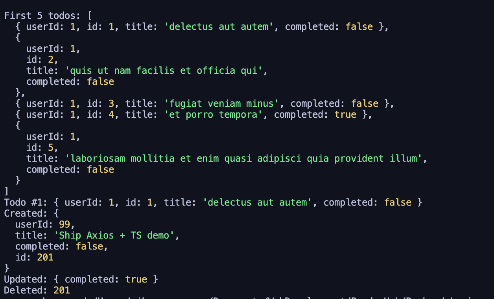

# Backend Logic (Axios + TypeScript)


---

## 📖 Overview
This project demonstrates making a network/API call using **Axios** in **TypeScript**.  
The objective is to showcase:
- Fetching data from a public API
- Using **TypeScript** interfaces for strong typing
- Structuring code with a dedicated service layer
- Writing reusable and maintainable backend logic

---

## 🚀 Features
✅ Fetches data from a **public API** (`JSONPlaceholder`)  
✅ Implements **TypeScript interfaces** for type safety  
✅ Organized into service-based architecture  
✅ Clean error handling and logging  

---

## 🛠️ Installation & Running

### 1️⃣ Clone the Repository
```bash
git clone https://github.com/NikooNasrpooya/Backend-Logic-ToDo.git
cd Backend-Logic-ToDo
```

### 2️⃣ Install Dependencies
```bash
npm install
```

### 3️⃣ Run the Project
```bash
npm run start
```

---

## ⚙️ How It Works
**`services/todoService.ts`**
```ts
import axios from "axios";
import { Todo } from "../types/todo";

const API_URL = "https://jsonplaceholder.typicode.com/todos";

export const fetchTodos = async (): Promise<Todo[]> => {
  const response = await axios.get<Todo[]>(API_URL);
  return response.data;
};
```

**`index.ts`**
```ts
import { fetchTodos } from "./services/todoService";

fetchTodos()
  .then((todos) => console.log(todos))
  .catch((err) => console.error("Error fetching todos:", err));
```

---

## 📸 Screenshots / Output

**Console Output:**




---
